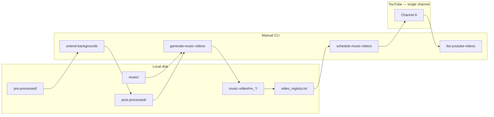
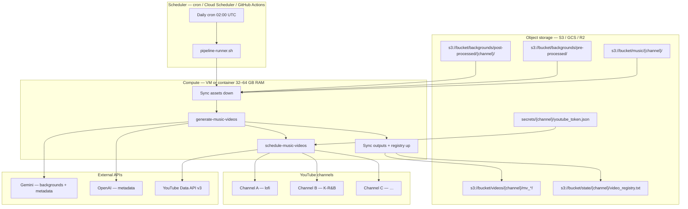

# Future plan: hosting, YouTube, and batch production

Living document summarizing the production workflow, lessons learned, and planned next steps for the **ai-music-assembler** pipeline.

Last updated: 2026-06-18

---

## Goals

Build a repeatable pipeline that:

1. Turns raw photos + MP3s into **75–90 minute** playlist videos (1920×1080, per-song titles, YouTube chapter tracklists).
2. Renders **branded thumbnails** (text behind the subject via BiRefNet segmentation).
3. Generates **YouTube metadata** (title + description) with OpenAI or Gemini.
4. **Hosts videos on YouTube** — not self-hosted — with optional staggered publish scheduling.
5. Runs in **batches** locally today, with a path to heavier cloud encoding later if needed.

---

5. Runs in **batches** locally today, with a documented path to **hosted cloud production** (object storage + scheduled workers + multi-channel YouTube).

---

## Architecture: today vs target

### Today (local Mac)



| Phase | Command | What it does |
|-------|---------|--------------|
| Backgrounds (optional) | `extend-backgrounds` | Gemini image API: `pre-processed/` → 16:9 `post-processed/` |
| Single video | `upload-music-video` | Build one video + metadata + upload immediately |
| Batch build | `generate-music-videos` | Build N videos in parallel → registry as `pending` |
| Batch upload | `schedule-music-videos` | Upload all `pending` entries, schedule publish times (with retries) |
| Channel audit | `list-youtube-videos --scheduled-only` | List titles + publish times from YouTube API |

**Key design choice:** generation and upload are **split into two commands**. Building N videos is CPU/RAM-heavy; uploading is I/O-bound and uses the YouTube API.

**Limitation today:** one OAuth token (`youtube_token.json`) → **one YouTube channel**. All assets live on local disk.

---

## Target hosting architecture

Move from “run commands on a Mac” to a **hosted production platform**: assets in object storage, assembly on a worker, orchestration via cron (or a job queue), and **multiple YouTube channels** from one control plane.



### Design principles

| Principle | Rationale |
|-----------|-----------|
| **YouTube is the CDN** | Final MP4s are published to YouTube; object storage holds working copies and backups, not public streaming. |
| **Object storage is source of truth** | Music library, backgrounds, rendered videos, and registry state live in a bucket — not on a single laptop. |
| **Separate build from publish** | Same as today: fill a registry with `pending` builds, then upload/schedule in a second pass. |
| **One channel = one config profile** | Each channel has its own music folder, backgrounds, thumbnail text, metadata prompt, OAuth token, and registry. |
| **Idempotent daily runs** | Cron should skip work already done (registry status, object existence checks, used-background tracking). |

---

## Infrastructure components

### 1. Music storage (online)

**Purpose:** Central MP3 library per channel (or shared pool with channel-specific playlists).

| Local today | Target |
|-------------|--------|
| `music/*.mp3` | `s3://{bucket}/music/{channel_id}/` |

**Recommendations:**

- Store **lossless or high-bitrate MP3s** in object storage; sync to worker before each build.
- Optional **versioning** on the bucket so accidental deletes are recoverable.
- **Inventory manifest** (`music/{channel}/manifest.json`) listing track count, last updated, checksums — useful for auditing mixes.
- Upload path: `aws s3 sync ./music s3://bucket/music/channel-a/` (or rclone / gsutil).

**Worker behavior:** at job start, `sync s3://…/music/{channel}/ → /work/music/`.

---

### 2. Video & asset storage (online)

**Purpose:** Persist backgrounds, rendered run folders, thumbnails, and registry state.

| Asset | Target path | Notes |
|-------|-------------|-------|
| Raw photos | `backgrounds/pre-processed/` | Input to `extend-backgrounds` |
| Extended backgrounds | `backgrounds/post-processed/{channel}/` | Per-channel art direction |
| Used backgrounds | `backgrounds/post-processed/{channel}/used/` | Same semantics as local `used/` |
| Rendered runs | `videos/{channel}/mv_{timestamp}_{nn}/` | `frame.png`, mix, mp4, thumbnail, metadata txt |
| Registry | `state/{channel}/video_registry.txt` | JSON-lines; `pending` / `uploaded` |
| Used titles | `state/{channel}/youtube_used_titles.txt` | Per-channel title dedup |
| Prompts | `config/{channel}/youtube_metadata.txt` | Optional per-channel metadata tone |

**Lifecycle policy (optional):** after YouTube upload + 30 days, move old MP4s to **Glacier / cold storage** or delete if YouTube is the archive.

**Worker behavior:**

1. Sync `post-processed/`, `state/`, and prompts **down**.
2. Run pipeline into `/work/music-video/`.
3. Sync new `mv_*` folders and updated registry **up**.

---

### 3. Scheduler & daily pipeline

**Purpose:** Run production unattended every day (or N times per week) per channel.

#### Option A — Cron on a dedicated VM (simplest)

Single **always-on or daily-booted** worker (e.g. AWS EC2 `c7i.2xlarge`, 32 GB RAM, or Hetzner dedicated).

```cron
# /etc/cron.d/music-assembler — one line per channel
0 2 * * * deploy /opt/ai-music-assembler/scripts/run-channel.sh channel-a >> /var/log/asm/channel-a.log 2>&1
0 6 * * * deploy /opt/ai-music-assembler/scripts/run-channel.sh channel-b >> /var/log/asm/channel-b.log 2>&1
```

**`run-channel.sh` (conceptual daily flow):**

```bash
#!/usr/bin/env bash
set -euo pipefail
CHANNEL="$1"
WORK="/work/${CHANNEL}"
BUCKET="s3://your-bucket"

# 1. Sync inputs
aws s3 sync "${BUCKET}/music/${CHANNEL}/"        "${WORK}/music/"
aws s3 sync "${BUCKET}/backgrounds/post-processed/${CHANNEL}/" "${WORK}/post-processed/"
aws s3 sync "${BUCKET}/state/${CHANNEL}/"        "${WORK}/state/"
aws s3 cp  "${BUCKET}/secrets/${CHANNEL}/youtube_token.json" "${WORK}/youtube_token.json"

# 2. Build (if backgrounds low, extend first — weekly job)
cd /opt/ai-music-assembler && source .venv/bin/activate
generate-music-videos -n 1 --thumbnail-text "OMYO" --workers 2 \
  --registry "${WORK}/state/video_registry.txt" \
  # … channel-specific flags from config/channels/${CHANNEL}.yaml

# 3. Upload pending (retries built-in)
schedule-music-videos \
  --registry "${WORK}/state/video_registry.txt" \
  --token-file "${WORK}/youtube_token.json" \
  --start "$(date -v+1d +'%Y-%m-%d') 09:00" \
  --interval-hours 24 \
  --upload-retries 5

# 4. Sync outputs back
aws s3 sync "${WORK}/music-video/" "${BUCKET}/videos/${CHANNEL}/"
aws s3 sync "${WORK}/state/"       "${BUCKET}/state/${CHANNEL}/"
aws s3 cp  "${WORK}/youtube_token.json" "${BUCKET}/secrets/${CHANNEL}/"  # refreshed token
```

#### Option B — Managed scheduler + ephemeral worker

- **Cloud Scheduler** (GCP) or **EventBridge** (AWS) triggers a **Lambda / Cloud Run Job / Batch** container daily.
- Container pulls config + secrets, runs the same script, exits.
- Better for cost (pay per run) but more setup; long encodes (75–90 min video) need **minimum 2–4 vCPU, 16–32 GB RAM**, often **30–90 min wall time** per video.

#### Option C — Job queue (scale-out)

When building **many videos per day across channels**:

- Cron **enqueues** jobs: `{ channel, action: build|upload, count }`.
- **Redis / SQS / Celery** workers pull one encode job at a time (avoids OOM).
- Upload workers separate from encode workers (I/O vs CPU).

**Not needed until** >3 concurrent encodes or >5 channels.

---

### 4. Multi-channel YouTube management

**Today:** one `client_secret*.json` + one `youtube_token.json` → one channel.

**Target:** a **channel registry** (YAML or JSON) driving the scheduler:

```yaml
# config/channels.yaml (future)
channels:
  - id: channel-a
    name: "Late Night Lofi"
    youtube_channel_id: UCxxxx
    thumbnail_text: "OMYO"
    videos_per_day: 1
    music_prefix: s3://bucket/music/channel-a/
    backgrounds_prefix: s3://bucket/backgrounds/post-processed/channel-a/
    registry: s3://bucket/state/channel-a/video_registry.txt
    token_secret: secrets/channel-a/youtube_token.json
    client_secret: secrets/shared/google_oauth_client.json
    metadata_prompt: config/channel-a/youtube_metadata.txt
    publish:
      hour_local: 9
      timezone: America/New_York
      interval_hours: 24

  - id: channel-b
    name: "K-R&B Mood"
    thumbnail_text: "VIBE"
    # …
```

**OAuth model:**

| Secret | Scope |
|--------|--------|
| Google OAuth **client** JSON | One per Google Cloud project (can be shared) |
| **Refresh token** per channel | `youtube_token.json` — authorize each channel once, store in secrets manager |

**Implementation backlog:**

- [ ] `schedule-music-videos --channel channel-a` reading from `channels.yaml`
- [ ] `list-youtube-videos --token-file …` per channel (already supports `--token-file`)
- [ ] Secrets in **AWS Secrets Manager / GCP Secret Manager**, not plain S3 (tokens encrypted at rest)
- [ ] **Quota awareness** — YouTube upload quota is per Google Cloud project; multiple channels under one project share quota

**Daily multi-channel cron:**

```cron
0 2 * * * run-channel.sh channel-a
0 3 * * * run-channel.sh channel-b
0 4 * * * run-channel.sh channel-c
```

Stagger starts to avoid RAM contention if one worker handles all channels sequentially.

---

### 5. Secrets & configuration

| Secret / config | Storage (target) | Used by |
|-----------------|------------------|---------|
| `GEMINI_API_KEY` | Env / secrets manager | `extend-backgrounds`, metadata |
| `OPENAI_API_KEY` | Env / secrets manager | Metadata |
| Google OAuth client JSON | Secrets manager | All channels (shared) |
| `youtube_token.json` | **Per-channel** secret | Upload + list |
| `.env` | Never in git; inject at runtime | Worker |

---

### 6. Observability & ops

| Concern | Approach |
|---------|----------|
| **Logs** | Cron stdout → CloudWatch / Loki / file + logrotate |
| **Alerts** | Email/Slack if `schedule-music-videos` exits non-zero or 0 uploads |
| **Health** | Daily `list-youtube-videos --scheduled-only` → compare to registry |
| **Failed uploads** | Registry stays `pending`; retry next cron run (retries already in CLI) |
| **Disk** | Worker uses ephemeral `/work`; sync only what's needed |

---

## Migration path: local → hosted

| Step | Action | Effort |
|------|--------|--------|
| 1 | Pick object storage (S3 recommended; R2 for zero egress to Cloudflare) | Low |
| 2 | Upload `music/`, `post-processed/`, existing `music-video/` to bucket | Low |
| 3 | Provision worker VM (32 GB RAM, ffmpeg preinstalled) | Medium |
| 4 | Script `run-channel.sh` with sync in/out | Medium |
| 5 | Install cron for one channel; validate one daily build + upload | Medium |
| 6 | Authorize channel 2 OAuth; add second cron line | Low |
| 7 | Move tokens to secrets manager; add `channels.yaml` | Medium |
| 8 | Optional: replace cron with queue if volume grows | High |

**Keep local Mac as:** development machine, OAuth authorization workstation (browser flow), and emergency manual override.

---

## Cloud provider sketch (AWS example)

| Component | AWS service | Alternative |
|-----------|-------------|-------------|
| Object storage | S3 | GCS, Cloudflare R2 |
| Secrets | Secrets Manager | GCP Secret Manager, Vault |
| Scheduler | EventBridge + SSM Run Command | Cron on EC2, GitHub Actions cron |
| Worker | EC2 `c7i.2xlarge` spot | Hetzner AX52, GCP `n2-highmem-8` |
| Logs | CloudWatch Logs | Datadog, self-hosted Loki |

**Rough monthly cost (single channel, 1 video/day):** ~$50–120 (VM always-on) or ~$20–40 (daily spot job + S3 storage for ~500 GB library).

---

## Local environment (development)

### Setup checklist

```bash
cd /path/to/ai-music-assembler
python3 -m venv .venv
source .venv/bin/activate          # Windows: .venv\Scripts\activate
python3 -m pip install --upgrade pip
python3 -m pip install ".[youtube]"  # YouTube upload + segmentation deps
brew install ffmpeg                # if not already on PATH
cp .env.example .env               # fill in API keys
```

Use `pip install .` (not `pip install -e .` on Python 3.14+) so console scripts like `generate-music-videos` resolve correctly. Re-run after code changes.

### `.env` keys

| Variable | Used for |
|----------|----------|
| `GEMINI_API_KEY` | `extend-backgrounds`, optional Gemini segmentation/metadata |
| `OPENAI_API_KEY` | YouTube title/description (default provider) |
| `YOUTUBE_METADATA_PROVIDER` | `auto` \| `openai` \| `gemini` |

YouTube OAuth is **not** an env var. It uses a **`client_secret*.json`** file (Desktop app) in the project root, auto-discovered. The token is cached in `youtube_token.json`. Both files are gitignored.

---

## Content pipeline

### 1. Backgrounds

```bash
# Drop raw photos in pre-processed/, then:
extend-backgrounds
```

- Uses `prompts/background_master.txt` + Gemini image models.
- Output: `post-processed/` (16:9 PNGs, ~1600px wide by default).
- Skips files that already exist unless `--force`.

### 2. Music library

- MP3s live in `music/`.
- Each video picks a random shuffle; mix length defaults to **75–90 minutes**.
- Tracklist written as `mv_*_tracklist.txt` (YouTube chapter format).

### 3. Background inventory

| Folder | Meaning |
|--------|---------|
| `post-processed/` | Available backgrounds for new videos |
| `post-processed/used/` | Backgrounds retired **after a video fully completes** |
| `music-video/mv_*/frame.png` | Copy of the chosen still (self-contained per run) |

**Critical behavior:** images move to `used/` only **after encoding finishes successfully**. If a run is killed mid-batch, incomplete jobs keep their source images in `post-processed/`.

---

## Batch production workflow

### Step 1 — Generate N videos

```bash
generate-music-videos -n 5 --thumbnail-text "OMYO" --workers 2
```

What happens:

- Each video gets a **distinct** random background (no reuse within the batch).
- Per-video folder: `music-video/mv_<timestamp>_<NN>/`
  - `frame.png`, `mv_*_mix.mp3`, `mv_*_video.mp4`, `mv_*_tracklist.txt`
  - `mv_*_thumbnail.png` (when `--thumbnail-text` is set)
  - `mv_*_title.txt`, `mv_*_description.txt` (metadata generated **before** encode, so API errors fail fast)
- Successful builds append a **`pending`** row to `music-video/video_registry.txt` (JSON-lines).
- Titles are deduplicated via a used-titles log.

There is **no single command** that builds and uploads multiple videos. Always two steps: `generate-music-videos` then `schedule-music-videos`.

### Step 2 — Schedule / upload

```bash
# Preview
schedule-music-videos --start "2026-06-20 09:00" --interval-hours 24 --dry-run

# Upload + schedule 1/day going public
schedule-music-videos --start "2026-06-20 09:00" --interval-hours 24

# Or upload immediately (no schedule)
schedule-music-videos --no-schedule --privacy private
```

On success, registry entries flip to **`uploaded`** with YouTube id, URL, and `publish_at`.

### Single-video alternative

For one-off builds + immediate upload:

```bash
upload-music-video --thumbnail-text "OMYO"
upload-music-video --no-upload   # preview metadata only
```

---

## YouTube setup and publishing

### One-time Google Cloud setup

1. Create a project in [Google Cloud Console](https://console.cloud.google.com/).
2. Enable **YouTube Data API v3**.
3. Configure OAuth consent screen.
4. Create OAuth client ID → type **Desktop app**.
5. Download JSON → place as `client_secret*.json` in project root (never commit).

First upload opens a browser for channel authorization; token saved to `youtube_token.json`.

### Metadata

- Prompt: `prompts/youtube_metadata.txt` (edit tone/format here).
- Provider: OpenAI (`gpt-4o-mini` default) or Gemini (`gemini-2.5-flash`).
- Tracklist chapters appended automatically to the description.

### Thumbnails

- When `--thumbnail-text` is used, the rendered PNG is uploaded as the **custom thumbnail**.
- Requires a **verified** YouTube channel; otherwise upload succeeds but thumbnail is skipped with a warning.

### Scheduling

Default `schedule-music-videos` behavior:

- Uploads each video as **private** with a future **`publishAt`** time.
- Stagger: `--start` + (`index` × `--interval-hours`).
- Default interval: **24 hours** (one video per day).

### Upload reliability

`schedule-music-videos` retries transient failures (timeouts, connection errors, HTTP 429/5xx):

- Default: **3 attempts**, backoff **30s × attempt number**
- Flags: `--upload-retries N`, `--retry-delay SEC`
- Failed entries stay **`pending`** in the registry → safe to re-run the command

---

## Performance and hosting constraints (lessons learned)

### OOM kill on local Mac (2026-06-17)

Command that failed:

```bash
generate-music-videos -n 7 --thumbnail-text "OMYO" --workers 5
```

Symptom: `zsh: killed`, exit code **137** (SIGKILL) — macOS killed the process under memory pressure.

Cause at ~55% progress:

- **5 parallel workers** each running ffmpeg encode (75–90 min 1080p H.264) and/or BiRefNet thumbnail segmentation (~1 GB model + alpha matting).
- **16 GB RAM** is not enough for `--workers 5` with thumbnails enabled.

### Safe worker guidelines (16 GB Mac)

| Setting | Recommendation |
|---------|----------------|
| `--workers` | **2** (conservative) or **3** (default cap) |
| With `--thumbnail-text` | Prefer **2 workers** |
| Without thumbnails | Up to **3 workers** is usually fine |
| Close other heavy apps | Browser, IDE, etc. during long encodes |

Default in code: `min(count, 3)` — do not exceed 3 on this machine unless RAM is upgraded or encoding moves to cloud.

### Failed batch recovery (`mv_20260617_192452_*`)

| Music ID | Status | Source image | Image location |
|----------|--------|--------------|----------------|
| `mv_20260617_192452_00` | **Complete** (video + thumbnail) | `pinterest-39.png` | `post-processed/` |
| `mv_20260617_192452_01` | Incomplete (no video/thumbnail) | `pinterest-37.png` | `post-processed/` |
| `mv_20260617_192452_02` | Incomplete | `pinterest-11.png` | `post-processed/` |
| `mv_20260617_192452_03` | Incomplete | `pinterest-pin-26.png` | `post-processed/` |
| `mv_20260617_192452_04` | Incomplete | `pinterest-34.png` | `post-processed/` |
| `_05`, `_06` | Never started (queued when killed) | — | — |

**Recovery actions:**

1. Manually register `mv_20260617_192452_00` in `video_registry.txt` if not already there (it completed but the batch died before registry write).
2. Delete or ignore partial folders `_01`–`_04` before re-running (optional cleanup).
3. Re-run with fewer workers:
   ```bash
   generate-music-videos -n 5 --thumbnail-text "OMYO" --workers 2
   ```
4. Only **5 backgrounds** remain in `post-processed/` — run `extend-backgrounds` on new photos before attempting `-n 7` again.

### Upload status (2026-06-18)

Batch `mv_20260617_180732_*`: **4/5 uploaded** to YouTube; `_01` failed with timeout — re-run `schedule-music-videos` for the remaining pending entry.

Verify scheduled queue:

```bash
list-youtube-videos --scheduled-only
```

---

## Future hosting options (summary)

| Mode | When to use |
|------|-------------|
| **Local Mac** | Development, OAuth setup, small batches (see [Target hosting architecture](#target-hosting-architecture) for production) |
| **VM + cron + S3** | First production setup; 1–5 channels |
| **Ephemeral container + scheduler** | Cost optimization; predictable daily window |
| **Job queue** | High volume; many parallel encodes |

Details are in [Target hosting architecture](#target-hosting-architecture) above. Options B/C from the earlier draft are folded into that section.

---

## Immediate next steps

- [x] **Upload backlog (partial):** 4/5 `mv_20260617_180732_*` uploaded; retry `_01`.
- [ ] **Confirm scheduled videos on YouTube:** `list-youtube-videos --scheduled-only`
- [ ] **Recover completed video from failed batch:** add `mv_20260617_192452_00` to registry if missing.
- [ ] **Re-run failed/incomplete encodes** with `--workers 2`.
- [ ] **Replenish backgrounds:** `extend-backgrounds` on new photos in `pre-processed/`.
- [ ] **Prototype `run-channel.sh`** + S3 sync for one channel (migration step 4).
- [ ] **Draft `config/channels.yaml`** for second YouTube channel.

---

## Future improvements (backlog)

### Pipeline reliability

- [ ] **Resume partial runs** — detect incomplete `mv_*` folders and continue from last step.
- [ ] **Memory-aware worker cap** — auto-set `--workers` based on available RAM.
- [ ] **Don't run overlapping batches** — lock file or warning if another `generate-music-videos` is active.
- [ ] **Registry repair tool** — scan `music-video/` for complete folders missing from registry and append them.

### YouTube / metadata

- [ ] **`config/channels.yaml`** — multi-channel profiles (music path, token, thumbnail text, publish schedule).
- [ ] **`run-channel.sh`** — sync → build → upload → sync for one channel (cron entrypoint).
- [ ] **Per-channel `--channel` flag** on `generate-music-videos` / `schedule-music-videos`.
- [ ] **OAuth client secret via env var** — optional for CI/cloud (file-based is current default).
- [ ] **Tags / category presets** in channel config.

### Hosting / scale

- [ ] **S3 (or R2) bucket layout** — implement sync scripts for music, backgrounds, videos, state.
- [ ] **Secrets manager integration** — per-channel `youtube_token.json`, API keys.
- [ ] **Weekly `extend-backgrounds` cron** — separate from daily video job.
- [ ] **Separate thumbnail pass** — generate thumbnails sequentially, then encode (reduces peak RAM).
- [ ] **Job queue** — when >1 encode must run in parallel on hosted worker.

---

## Quick reference commands

```bash
# Activate environment
source .venv/bin/activate

# Extend backgrounds
extend-backgrounds

# Batch build (safe settings for 16 GB Mac)
generate-music-videos -n 5 --thumbnail-text "OMYO" --workers 2

# Preview upload schedule
schedule-music-videos --start "2026-06-20 09:00" --interval-hours 24 --dry-run

# Upload pending videos (with retries)
schedule-music-videos --start "2026-06-20 09:00" --interval-hours 24 --upload-retries 5

# List scheduled videos on YouTube
list-youtube-videos --scheduled-only

# Single video build + upload
upload-music-video --thumbnail-text "OMYO"
```

---

## Related files

| Path | Purpose |
|------|---------|
| `README.md` | Full CLI reference and install docs |
| `prompts/youtube_metadata.txt` | Title/description generation prompt |
| `prompts/background_master.txt` | Gemini background extension prompt |
| `music-video/video_registry.txt` | Pending/uploaded video registry (local; → `state/{channel}/` in cloud) |
| `music_assembler/youtube_channel.py` | List channel / scheduled videos via YouTube API |
| `.env.example` | Environment variable template |
| `client_secret*.json` | Google OAuth client (gitignored) |
| `youtube_token.json` | Cached OAuth token — one channel today; per-channel in cloud |
